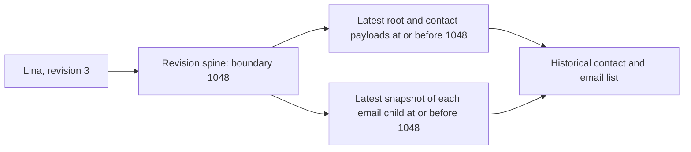

# 3. Ask history a question

[← Follow one Save](02-follow-one-save.md) · [Contents](README.md) · [Next: Why the write path has more steps →](04-why-the-write-path-has-more-steps.md)

Six months later, someone asks why Lina's work address became the contact-card email. This is where the separate records from the previous chapter become useful.

There are three related questions: what the contact looked like, what changed between two revisions, and what actions took place. The implementation gives them separate answers.

## First question: what did revision 3 look like?

The reader starts with Lina's identity and revision 3. It looks up that pair in `entities.entity_version_history` and finds the corresponding local boundary, 1048 in our example.

The word **spine** refers to this small revision-to-transaction map. It does not hold every field of the contact.

Suppose Lina's name was last changed at 1030. The reader uses that root/contact payload because it was still in effect at 1048. It does not require every payload table to have a row stamped exactly 1048.

For each email child, it similarly finds the latest applicable snapshot. A deletion snapshot means the association was absent at that boundary. Finally, it orders the surviving children by their historical saved positions.

At revision 3, we get the old work address in position 2. At revision 4, boundary 1052, we get the corrected address in position 1.

This algorithm depends on successive changes to **Lina** receiving increasing local audit numbers. It does not require unrelated contacts to commit in allocation order. Nor does it make 1052 a certified snapshot boundary for every tenant and table in the database.

## Second question: what changed from 3 to 4?

A diff compares the two reconstructed states. It finds that child 7 changed address and position, and child 1 changed position. Stable child identity is what lets it recognize the same email association across that move.

Comparing only live rows would answer a different question. Lina may now be at revision 12, with another address and a different name. The historical reader obtains the supported root/contact fields from historical payloads rather than substituting today's labels.

The current reader covers root context and the email family, including historical entity type. It is not yet a universal “reconstruct every contact child and account setting” API. Phone and address history must earn their own coverage before the reader can make that larger promise.

## Third question: what actions happened?

The final state tells us what survived the Save. The action records tell us that Mariana updated child 7 and then moved it. They preserve accepted values/references and action order; actor and recording time come from the shared ledger.

These are effective business actions. They are not an automatic trace of every SQL statement, UI keystroke or failed attempt.

Consider another operation: change an address from A to B, then change it back to A before commit. The final diff can be empty even though two real actions occurred. The implementation permits a final history snapshot equal to the entry state and preserves the action evidence. It does not erase the aggregate revision just because the final values came back to their starting point.

That distinction matters to the investigations your original design has supported. If a future payment operation uses B between those changes, its own action evidence must preserve the value or historical reference it used. Final contact state alone cannot prove it. The email reference demonstrates ordered evidence; it does not implement payment processing or capture arbitrary intermediate reads for other families.

## Why updating a history row can be correct

The phrase “history is updated” can sound like a violation of the whole design. The allowed update is narrowly bounded: a writer may replace its **own uncommitted snapshot** while its unit is still being assembled.

In our example, the first command wrote child 7's corrected address at position 2. The second command updated that same unit's snapshot to position 1. After commit, the snapshot describes the final state of the child for 1052. Earlier committed snapshots remain untouched by this protocol.

For the email association, these lifecycle cases are useful to keep in mind:

| Within one unit | Final state history |
| --- | --- |
| Insert a new child, then edit it | One INSERT snapshot with its final values. |
| Edit an existing child several times | One UPDATE snapshot with its final values. |
| Delete an existing child | A DELETE snapshot preserving its last values. |
| Insert a new child, then delete it | No surviving child-state snapshot for that unit; identity, revision and action evidence can remain if the unit commits. |
| Delete and restore a child that existed at entry | An UPDATE snapshot for the restored final state, using the same identity. |

Restoring a deletion committed in an earlier unit reintroduces the same child identity. A fresh insertion creates a different child identity. Restoration appends to the saved list; it does not silently reclaim an old principal position.

## What the evidence cannot say

Business history rolls back with business data. If you need evidence of rejected logins, denied edits or failed attempts, that needs a separately durable security log with an explicit outcome. A rolled-back business ledger cannot also be that log. Such a general security-attempt log is outside this reference family.

Historical accuracy also depends on the starting evidence. An old database with today's emails and years of root transactions does not thereby have years of email history. Joining current emails onto every old root revision would manufacture an answer. A migration must distinguish known history, a known starting snapshot, and unknown earlier state; chapter 7 returns to this.

For the supported fresh-schema email path, the ledger explains the unit, the spine locates the revision, payload history reconstructs state, and actions explain the sequence of effective changes. Those are the four records worth remembering before learning their helper procedures.

For implementation details later: [the reader](../../src/Framework/Sistrategia.Data.SqlClient/Scripts/Contacts/Emails/create_contact_email_read.sql) and [history synchronization](../../src/Framework/Sistrategia.Data.SqlClient/Scripts/Contacts/Emails/create_contact_email_history_sync.sql).

[← Chapter 2](02-follow-one-save.md) · [Next: Why the write path has more steps →](04-why-the-write-path-has-more-steps.md)
